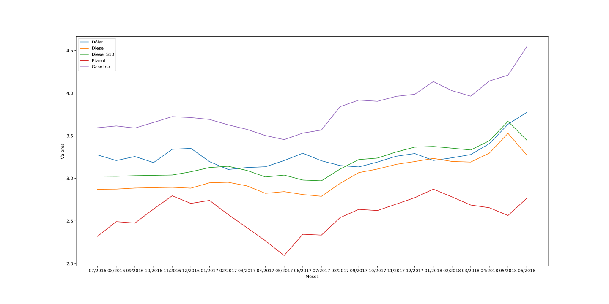

# Trabalho para Pós-Graduação de Banco de Dados para BigData

O exercício prosposto pelo Professor Rodrigo Faccioli com uso de Jupyter Notebbok em Python com Cassanda

## Fonte de dados

[Informações sobre a base valores de vendas de combustíveis](http://dados.gov.br/dataset/serie-historica-de-precos-de-combustiveis-por-revenda)

Realizar Download da base de dados 

**Preços de Combustíveis**  
[Segundo Semestre de 2016](http://www.anp.gov.br/images/dadosabertos/precos/2016-2_CA.csv)  
[Primeiro Semestre de 2017](http://www.anp.gov.br/images/dadosabertos/precos/2017-1_CA.csv)  
[Segundo Semestre de 2017](http://www.anp.gov.br/images/dadosabertos/precos/2017-2_CA.csv)  
[Primeiro Semestre de 2018](http://www.anp.gov.br/images/dadosabertos/precos/2018-1_CA.csv)  

**Cotação de Doláres**
[Cotações de Dólares](http://api.bcb.gov.br/dados/serie/bcdata.sgs.10813/dados?formato=csv)

## Cassandra

Servidor Cassandra, substituir `D:/Data/Cassandra/`

```shell
docker run --name cassandra -p 9042:9042 -v D:/Data/Cassandra/:/var/lib/cassandra/ --rm -d cassandra
```

Executar CQL Shell

```shell
docker run -it --link cassandra --rm cassandra cqlsh cassandra
```
 
Executar os comandos no arquivo `gas_price.cql` pelo Shell  
Visualizar todas as tabelas do servidor

```cqlsh
describe keyspaces
```

Visualizar todas as tabelas do servidor 

```cqlsh
describe tables
```

## Jupyter Notebook

Servidor Jupyter, substituir `D:\Dev\PyStudies\Cassandra_Gas_Price` pelo caminho dos notebooks e fontes de dados

```shell
docker run -it --name mi4u-dev -p 8888:8888 -p 8085:8085 -p 8086:8086 -v D:/Dev/PyStudies/Cassandra_Gas_Price/:/notebooks/ --link cassandra:cassandra --rm mi4u/dev:0.0.2 /bin/bash
```

Executar

```shell
jupyter lab --ip="0.0.0.0" --port=8888 --no-browser --allow-root
```

Gráfico da Variação de Combustíveis



## Informações Extras

Consultar dados do container

```shell
docker inspect <id container>
```

## Erros 

Para o erro `Connection error: ('Unable to connect to any servers'... Last error: Connection refused)}` ao chamar o **CQL Shell**, precisa liberar o acesso

```shell
rm -Rf ~/.cassandra
```

